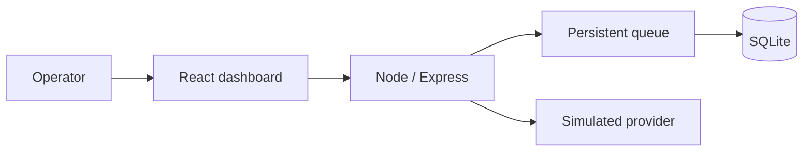

# Portfolio overview

## Architecture

## Core flow

1. A contact enters a persistent campaign queue with a unique delivery key.
2. Before processing, the queue checks consent and permanent opt-out records.
3. Recovery pauses interrupted work and requires explicit operator resumption.

## Environment and data

Set only local credentials described in the README. The dashboard, QR connection, provider response and delivery outcome in this repository are simulated; no WhatsApp message is sent.

## Decisions

- The simulation prevents accidental delivery while preserving operational queue behavior.
- Unique constraints prevent duplicate recipients and delivery attempts.
- Opt-out is persisted instead of merely hidden in the interface.
